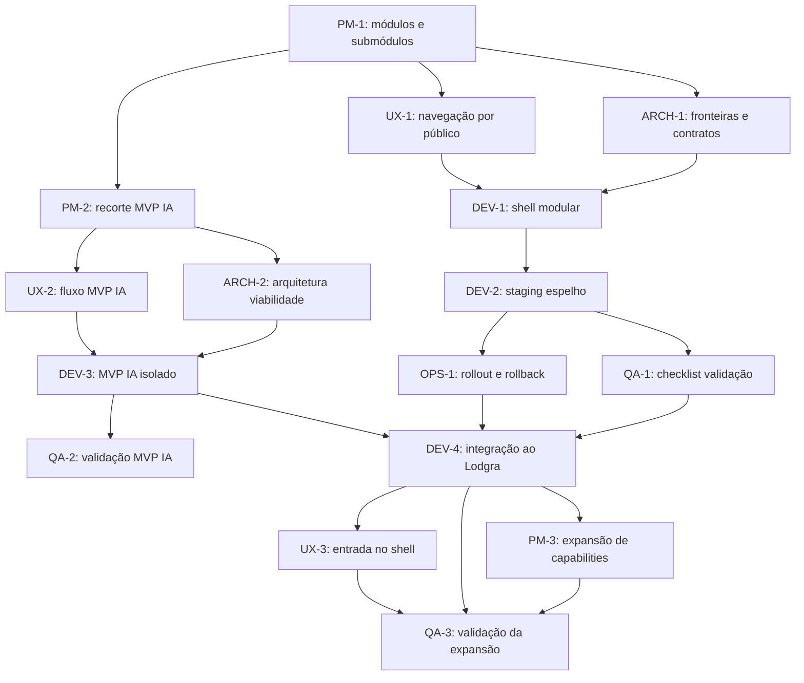

# Epic Modularização IA Native - Handoff Package

**Epic:** Evolução Modular do Lodgra + MVP de IA Native para Viabilidade de Propriedades  
**Status:** Ready for handoff
**Purpose:** pacote final de passagem para PM, Architect, UX, Dev, QA e DevOps

## 1. Resumo Executivo

O Lodgra precisa crescer como uma plataforma modular, sem continuar a acumular features como remendos soltos.

Esta epic define:
- separação clara entre Core, Operação, Empresa, Proprietário e IA Native
- uma estratégia de staging espelho da produção antes de mexer em produção
- um MVP de IA Native isolado para validar viabilidade de propriedades e previsão de retorno
- uma estrutura de stories e responsabilidades para orquestração entre agentes
- um PRD oficial para o módulo Lodgra Property Intelligence
- uma story 46.1 de corte funcional CLI-first para o MVP
- uma QA-3 de closeout para validar a política de expansão de capabilities

## 2. Objetivo do Handoff

Garantir que o próximo agente ou time possa começar com:
- visão do problema
- direção de produto
- fronteiras arquiteturais
- jornada de UX
- sequência de execução
- responsabilidades por papel

## 3. Estrutura do Trabalho

### Core da Plataforma
- autenticação
- organizações
- permissões
- moedas
- timezone
- formatação monetária
- auditoria
- navegação base
- design system

### Módulo Operacional
- propriedades
- reservas
- calendários
- hóspedes
- utilizadores
- configurações
- sincronizações

### Módulo Empresa
- receita consolidada
- custos operacionais
- lucro
- caixa
- leitura multi-moeda
- performance executiva

### Módulo Proprietário
- rentabilidade
- repasses
- despesas
- histórico
- relatórios individuais
- visão por propriedade

### MVP de IA Native
- viabilidade de propriedades
- previsão de retorno ao proprietário
- cenários conservador, base e otimista
- score de oportunidade
- recomendações assistidas

## 4. Árvore de Dependências

## 5. Ordem Recomendada de Execução

1. PM-1
2. ARCH-1
3. UX-1
4. DEV-1
5. DEV-2
6. QA-1
7. OPS-1
8. PM-2
9. ARCH-2
10. UX-2
11. DEV-3
12. QA-2
13. DEV-4
14. UX-3
15. PM-3
16. QA-3

## 6. Responsabilidades por Papel

### PM
- define visão, escopo e prioridade
- aprova recorte do MVP de IA
- controla expansão de capabilities

### Architect
- define fronteiras e contratos
- garante baixo acoplamento
- valida integração futura

### UX
- desenha navegação por público
- organiza leitura por módulo
- define clareza da capability de IA

### Dev
- constrói shell modular
- prepara staging espelho
- implementa MVP e integração

### QA
- valida navegação, contexto e regressão
- aprova readiness antes de produção
- valida a política de expansão depois da integração

### DevOps
- coordena rollout e rollback
- controla promoção por wave

## 7. Checklist de Handoff

- [x] Epic principal definida
- [x] Índice da epic criado
- [x] Sequência operacional criada
- [x] Matriz de responsabilidades criada
- [x] Wave 1 execution pack criado
- [x] Wave 2 execution pack criado
- [x] Wave 3 execution pack criado
- [x] Wave 4 execution pack criado
- [x] Consolidated view criada
- [x] Wave 1 criada
- [x] Wave 2 criada
- [x] Wave 3 criada
- [x] Wave 4 criada
- [x] Ordem de execução definida
- [x] Closeout de expansão definido
- [x] Estratégia de staging espelho definida
- [x] MVP de IA Native isolado do core
- [x] Critérios de aceite da epic escritos
- [x] File list final consolidada
- [x] PRD oficial do módulo criado
- [x] Story 46.1 criada como primeiro corte funcional
- [x] Story QA-3 criada como closeout de governança
- [x] PM-2, ARCH-2, UX-2, DEV-3, QA-2, DEV-4, UX-3, PM-3 e QA-3 alinhadas para closeout
- [x] OPS-1 documentada com closeout operacional e ressalva de restauração em produção

## 8. Critério para Iniciar a Execução

A execução pode começar quando:
- o PM aprovar o recorte do módulo e do MVP
- o Architect aprovar fronteiras e contratos
- o UX aprovar a navegação e a leitura por público
- o Dev tiver clareza do shell base
- o QA tiver checklist para validar a fundação
- o DevOps tiver plano de rollout e rollback

## 8.5. Current Closeout State

- PM-2, ARCH-2, UX-2, DEV-3, QA-2, DEV-4, UX-3 and PM-3 are now marked Ready for Review in the story chain
- QA-3 has been updated with the expansion-policy closeout
- OPS-1 has been validated with PASS WITH CONCERNS, keeping the staging restore point explicit and the production restore point as a follow-up
- the repository now has a reusable expansion policy artifact for future capability gating

## 9. Referências

- [Epic principal](epic-modularizacao-ia-native.md)
- [Índice da epic](epic-modularizacao-ia-native-index.md)
- [Sequência operacional](epic-modularizacao-ia-native-sequencia.md)
- [Matriz de responsabilidades](epic-modularizacao-ia-native-responsabilidades.md)
- [Wave 1 execution pack](epic-modularizacao-ia-native-wave-1.md)
- [Wave 2 execution pack](epic-modularizacao-ia-native-wave-2.md)
- [Wave 3 execution pack](epic-modularizacao-ia-native-wave-3.md)
- [Wave 4 execution pack](epic-modularizacao-ia-native-wave-4.md)
- [Consolidated view](epic-modularizacao-ia-native-consolidated-view.md)
- [PRD oficial do módulo](../product/lodgra-property-intelligence-prd.md)
- [Story 46.1](46.1-property-intelligence-cli.story.md)
- [Story QA-3](ia-native/qa-3-validar-expansao-capabilities.md)

## 10. QA-1 Status Note

As de 2026-08-21, a QA-1 já tem evidência para o contexto do módulo ativo na top bar e no shell labels do preview autenticado.
A QA-1 também já tem evidência de contrato para o feature gate: `IA Native` está marcado como `published: false`, não entra em `getModuleNavLinks()` e cai para o shell Core em `getModuleForPath()`, sem alterar o restante da navegação.
A QA-1 também já tem evidência de contrato para fallback: módulos ocultos deixam de aparecer nos links publicados e rotas sem match resolvem para o Core, em vez de quebrar o shell.
A QA-1 também já tem evidência de contrato para rollback disablement: o rollback deve desligar a entrada do módulo primeiro, manter o shell operando normalmente e não exigir migração de dados nesta fase.
A QA-1 também já tem evidência operacional de staging: o preview autenticado validado em 2026-08-21 respondeu `200 OK` para `/pt-BR/dashboard`, `/pt-BR/admin/users` e `/pt-BR/owners`, com os labels esperados no desktop e no mobile, então o espelho já reproduz o shell modular necessário para a QA-1.

A prova visual do item de contexto de moeda continua bloqueada neste ambiente porque:
- o binário local do Playwright não conseguiu iniciar
- o browser controlado bloqueou acesso a `vercel.com` por política de segurança ao abrir o preview protegido

QA-1 fica com o núcleo validado e apenas a prova visual de moeda bloqueada por browser policy neste ambiente; esse bloqueio deve ser tratado como limitação documentada, não como dívida de produto.
O próximo passo na cadeia é OPS-1, que já pode usar este pacote como base de rollout e rollback.

A validação de closeout da expansão segue em QA-3 depois da integração e da definição de PM-3.

## 11. Session Update - 2026-08-22

### What was advanced today
- the IA Native story chain moved through PM-2, ARCH-2, UX-2, DEV-3, QA-2, DEV-4, UX-3, PM-3, QA-3 and OPS-1 closeout alignment
- the expansion policy is now formalized in `docs/stories/ia-native/pm-3-expansion-policy.md`
- the QA-3 closeout now treats the policy as a reusable governance gate
- the operational closeout keeps staging restoration explicit and flags production restoration as a follow-up

### Resume point
1. use the ready-for-review story chain as the execution baseline
2. keep the expansion policy as the default gate for future capabilities
3. resolve the production restore-point follow-up before the next operational promotion if needed

## 11. Session Update - 2026-08-21

### What was completed today
- recovered local auth against the staging Supabase project
- switched local development to staging-first by default
- added a dedicated production-local startup command
- updated the staging setup guide to explain the new workflow
- confirmed the `codex@test.com` user in staging Auth and `public.user_profiles`
- verified successful login in the browser
- verified dashboard navigation after login

### Current working rule
- use `npm run dev` for staging
- use `npm run dev:production` only when explicitly checking production behavior
- avoid editing `.env.local` back and forth

### Next resume point
1. continue from the authenticated staging dashboard state
2. pick up the next QA or story task from the active epic
3. keep the staging-first local workflow as the default development path
