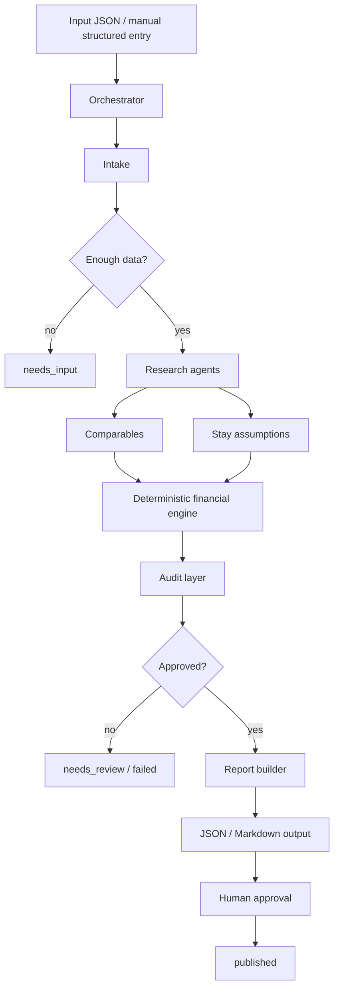
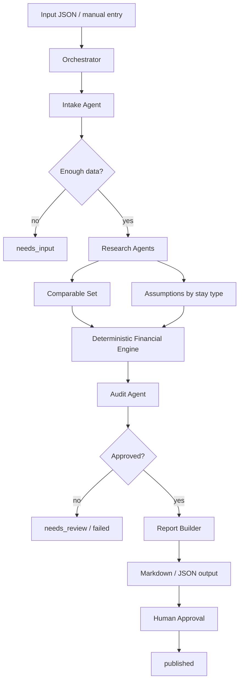

# Story ARCH-2 - Definir arquitetura do motor de viabilidade

**Epic:** Evolução Modular do Lodgra + MVP de IA Native para Viabilidade de Propriedades  
**Status:** Ready for Review  
**Owner:** @architect  
**Quality Gate:** @qa  
**Depends On:** PM-2

---

## Architecture Intent

O motor de viabilidade precisa ser desenhado como capability isolada:
- com entrada clara
- com processamento próprio
- com saída legível
- com integração futura possível
- com desligamento seguro

No entanto, para o Lodgra Property Intelligence, o "motor" não é apenas uma função matemática:
- existe um orquestrador que controla o workflow
- existem agentes especialistas com responsabilidades delimitadas
- existe um engine financeiro determinístico e versionado
- existe um audit layer que valida coerência, fontes e conflitos
- existe uma aprovação humana antes de publicação externa

## Story

**Como** arquiteto,  
**Quero** definir a arquitetura do motor de viabilidade e previsão de retorno,  
**Para que** o MVP de IA tenha fronteiras claras e seja integrável depois.

## Context

O MVP de IA Native será validado fora do core.

Por isso, esta story precisa responder:
- onde a inteligência vive
- como os dados entram
- como o resultado sai
- como o módulo pode ser isolado
- como a integração futura acontece sem reescrever o produto

Source of truth:
- [Lodgra Property Intelligence PRD](/Users/fabiogomes/Projetos/lodgra/docs/product/lodgra-property-intelligence-prd.md)
- [Story 46.1 - Property Intelligence CLI](/Users/fabiogomes/Projetos/lodgra/docs/stories/46.1-property-intelligence-cli.story.md)

## ARCH-2 Baseline

Esta arquitetura parte de dois artefatos já fechados:

- a PM-2 define o problema, a pergunta central, o público-alvo, as entradas, as saídas e os limites do MVP
- a story 46.1 define o primeiro corte funcional CLI-first, determinístico e sem dependência do shell

A arquitetura deve manter o MVP pequeno, rastreável e isolável, para que:
- a UX-2 possa desenhar uma leitura clara do resultado
- a DEV-3 possa implementar o motor sem acoplamento ao operacional
- a integração futura aconteça só depois de provar valor em isolamento

## Acceptance Criteria

### AC1: Arquitetura do fluxo
- [x] Existe definição de entrada, processamento e saída
- [x] Existe separação entre core comum e lógica do modelo
- [x] Existe separação entre resultado e apresentação
- [x] Existe distinção entre orquestrador, agentes e engine financeiro
- [x] Existe suporte a estados de análise rastreáveis

### AC2: Dependências controladas
- [x] O motor não depende do shell operacional
- [x] Moeda, timezone e formatação usam serviços comuns
- [x] O módulo pode ser isolado para teste
- [x] Proveniência de dados é preservada por tipo (`provided`, `observed`, `derived`, `estimated`, `overridden`)

### AC3: Integração futura
- [x] A arquitetura prevê integração posterior no Lodgra
- [x] A arquitetura prevê desativação segura
- [x] A arquitetura suporta expansão para novos casos de uso
- [x] A arquitetura prevê aprovação humana antes de publicação externa
- [x] A arquitetura não exige reescrita para adicionar UI posterior

### AC4: Pronto para UX e DEV
- [x] O contrato de entrada/saída pode ser consumido pela UX-2
- [x] O contrato de entrada/saída pode ser consumido pela DEV-3
- [x] O desenho não força dependência do operacional
- [x] O contrato contempla inputs mínimos e enriquecidos
- [x] O contrato contempla JSON e relatório editável

## Scope

### In scope
- fluxo de entrada/processamento/saída
- isolamento do motor
- uso de serviços comuns
- estratégia de integração futura
- estratégia de desligamento seguro

### Out of scope
- implementação do modelo
- integração ao shell do Lodgra
- desenho visual
- rollout em produção

## Deliverables

- diagrama de fluxo do motor
- contrato de entrada/saída
- princípios de integração futura
- estratégia de desligamento seguro
- base para UX-2 e DEV-3

## Architecture Checklist

### 1. Flow contract
- [x] Input enters as JSON or manual structured entry
- [x] Orchestrator owns the workflow and analysis states
- [x] Specialist agents research and normalize evidence
- [x] Deterministic engine computes the final scenarios
- [x] Presentation layer only renders approved structured output

### 2. Boundary contract
- [x] No dependency on operational shell internals
- [x] No direct write access to `properties`
- [x] No hardcoded external source assumptions
- [x] Core shared services handle currency, timezone, audit and versioning
- [x] Report publication requires human approval

### 3. Isolation contract
- [x] The module can run without the shell
- [x] The module can be disabled by feature gate
- [x] The engine is testable in isolation
- [x] Future UI exposure can be added without changing the core contract

### 4. Data contract
- [x] Inputs remain explicit and versioned
- [x] Outputs remain structured before prose
- [x] Assumptions stay attached to the analysis
- [x] Ranges are preserved instead of collapsed
- [x] Confidence is part of the contract

### 5. Shutdown contract
- [x] Disable module entry first
- [x] Preserve stable modules
- [x] Keep publication gated by human approval
- [x] Allow rollback without re-architecture

## Contract Summary

### Input
- JSON or manual structured input
- minimal or enriched property data
- provenance attached to each field

### Processing
- orchestrator coordinates the workflow
- specialist agents research and normalize evidence
- deterministic engine computes scenarios and returns structured results
- audit layer validates coherence, sources and conflicts

### Output
- JSON for machine use
- Markdown for human review
- future UI-ready structured payload
- explicit states: `draft`, `needs_input`, `researching`, `calculating`, `needs_review`, `approved`, `published`, `failed`, `superseded`

### Shared Services
- currency
- timezone
- feature gate
- audit/logging
- report generation
- formula and scenario version registry

### Non-Negotiables
- no shell dependency
- no production-only UI assumption
- no direct mutation of `properties`
- no publication without human approval
- no false certainty in financial outputs

## Architecture Model Addendum

---

## Architecture Model

### Logical layers

1. **Orchestrator**
   - owns the workflow
   - tracks analysis state
   - invokes specialist agents
   - merges outputs into a structured analysis package

2. **Specialist agents**
   - Intake
   - Location
   - Comparables
   - Short Stay
   - Mid Stay
   - Long Stay
   - Cost
   - Strategy
   - Audit
   - Report

3. **Deterministic financial engine**
   - applies versioned formulas
   - computes scenarios
   - produces gross, cost and net outputs
   - remains separate from narrative generation

4. **Presentation layer**
   - renders JSON / Markdown / future UI
   - never owns the calculation logic

### Flow

### Analysis states

- `draft`
- `needs_input`
- `researching`
- `calculating`
- `needs_review`
- `approved`
- `published`
- `failed`
- `superseded`

### Data contract principles

- input is explicit and versioned
- outputs are structured before they become prose
- assumptions are stored alongside the result
- ranges are preserved instead of collapsed into false certainty
- confidence is part of the contract, not an afterthought

### Shared services

- currency
- timezone
- feature gate
- audit/logging
- report generation
- version registry for formulas and scenario rules

### Isolation and shutdown

- the module must be callable without the shell
- the module must be disable-able by feature gate
- the report publication step must require human approval
- the engine must remain testable in isolation
- the architecture must allow future UI or API exposure without breaking the contract

### Dependency boundaries

**Can depend on**
- `core` shared utilities
- currency/timezone helpers
- existing forecasting and pricing primitives where relevant

**Cannot depend on**
- operational shell internals
- production-only UI assumptions
- direct write access to `properties`
- hardcoded external source assumptions

### Handoff to UX-2 and DEV-3

- UX-2 should design around the state machine and output contract
- DEV-3 should implement the orchestrator, specialist agents and deterministic engine separately
- neither story should require the shell to exist before the MVP is validated

## Handoff Package

### For UX-2
- design the result as a decision aid, not an operational form
- preserve the analysis state machine in the visual hierarchy
- make confidence, risk and assumptions visible in the main flow

### For DEV-3
- implement the orchestrator as the workflow owner
- keep specialist agents bounded and typed
- keep the financial engine deterministic and versioned
- keep the presentation layer separate from computation

### For QA-2 and future integration
- verify the engine works in isolation
- verify human approval is required before publication
- verify the module can be disabled without breaking the rest of the platform

## Handoff Notes

- esta story deve ser consumida após PM-2
- a próxima story da cadeia é UX-2
