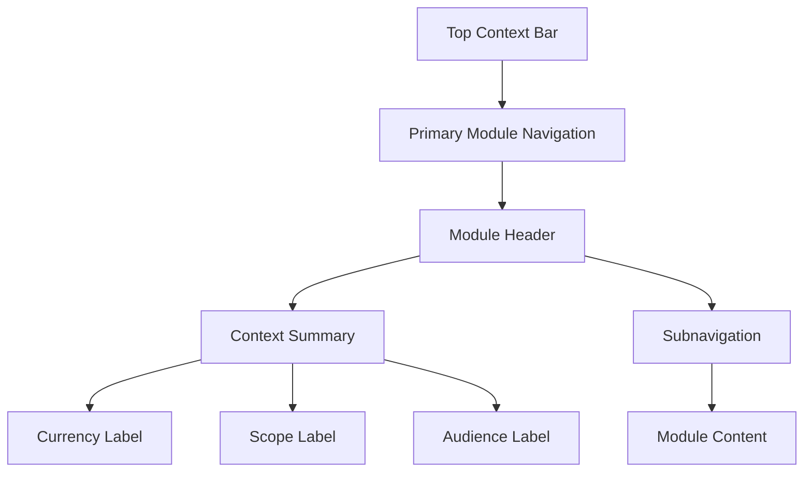

# Story UX-1 - Redesenhar navegação por público e intenção

**Epic:** Evolução Modular do Lodgra + MVP de IA Native para Viabilidade de Propriedades  
**Status:** Ready for Review  
**Owner:** @ux-design-expert  
**Quality Gate:** @pm + @architect  
**Depends On:** PM-1, ARCH-1

---

## UX Intent

A navegação do Lodgra precisa indicar com clareza onde o utilizador está e para que tipo de decisão aquela área existe.

Esta story converte o mapa de produto e os contratos de arquitetura em uma experiência de navegação legível por público:
- empresa
- operação
- proprietário
- IA Native

## Story

**Como** utilizador do Lodgra,  
**Quero** encontrar rapidamente a área certa do sistema,  
**Para que** eu saiba se estou na visão da empresa, da operação ou do proprietário.

## Context

A experiência atual mistura contextos próximos demais na navegação.

Isso faz com que:
- o utilizador precise adivinhar a área correta
- os módulos pareçam organizados por implementação
- a IA Native possa ser percebida como uma página isolada, e não como capability

## Acceptance Criteria

### AC1: Navegação por público
- [x] A navegação separa Empresa, Operação, Proprietário e IA
- [x] O texto dos módulos é compreensível sem depender do jargão técnico
- [x] A intenção de uso fica clara ao nível do menu

### AC2: Hierarquia visual
- [x] O módulo ativo é evidente
- [x] O contexto da página aparece no topo da tela
- [x] Submódulos não competem visualmente com o módulo principal

### AC3: Leitura por moeda e contexto
- [x] Valores multi-moeda não aparecem misturados sem rótulo
- [x] A visão executiva distingue consolidado vs por imóvel
- [x] O utilizador entende quando está a ver empresa ou propriedade

### AC4: Entrada do MVP de IA
- [x] A IA Native aparece como módulo próprio
- [x] A entrada do MVP explica valor e limitação
- [x] O fluxo do MVP não parece parte do operacional diário

### AC5: Pronto para shell modular
- [x] A navegação pode ser usada pelo shell da DEV-1
- [x] A navegação não depende de implementação ainda inexistente
- [x] O wireframe conceitual é suficiente para handoff

## Scope

### In scope
- mapa de navegação por público
- hierarquia visual dos módulos
- linguagem da entrada do MVP de IA
- guidelines de contexto e leitura

### Out of scope
- implementação de layout
- componentes finais
- staging
- integração de dados
- mudanças em produção

## Deliverables

- mapa de navegação por público
- wireframe conceitual do shell modular
- guidelines de leitura por módulo
- texto de entrada da capability IA

---

## Proposed Information Architecture

### Primary navigation
- `Empresa`
- `Operação`
- `Proprietário`
- `IA Native`

### Global context bar
Always visible at the top of the shell:
- organization name
- current module
- current property or portfolio scope, when applicable
- active currency context
- timezone context
- feature / plan state, when relevant

### Module-level subnavigation

#### Empresa
- visão geral
- caixa
- resultados
- custos
- rentabilidade
- relatórios

#### Operação
- propriedades
- reservas
- calendários
- hóspedes
- utilizadores
- sincronizações
- configurações

#### Proprietário
- resumo
- repasses
- despesas
- rentabilidade
- histórico
- relatórios por imóvel

#### IA Native
- avaliar viabilidade
- simular retorno
- cenários
- histórico de análises, se habilitado

---

## Navigation Rules

1. O módulo ativo deve ser destacado de forma inequívoca.
2. A navegação principal deve responder ao público, não ao endpoint técnico.
3. Submódulos só aparecem dentro do contexto do módulo principal.
4. A leitura de moeda deve estar sempre visível quando houver risco de ambiguidade.
5. A visão consolidada e a visão por imóvel nunca devem ter o mesmo peso visual.
6. A IA Native deve parecer uma capability de decisão, não uma extensão do fluxo operacional.

---

## Context Labels

Os seguintes rótulos devem ser usados para orientar o utilizador:

- `Visão da Empresa`
- `Operação do Portfólio`
- `Painel do Proprietário`
- `Módulo de IA Native`
- `Consolidado`
- `Por Imóvel`
- `Em moeda original`
- `Convertido para moeda base`

Regra:
- quando um valor puder ser mal interpretado, o contexto deve aparecer ao lado do número

---

## IA Native Entry Copy

Suggested entry text for the IA module:

**“Avalie a viabilidade de uma propriedade e estime o retorno esperado ao proprietário antes de entrar em operação.”**

Supporting copy:
- explica que é um módulo de decisão
- comunica que ainda está em validação
- diferencia resultado analítico de operação diária

---

## Conceptual Wireframe

Wireframe intent:
- topo sempre informa contexto
- navegação principal separa públicos
- conteúdo muda sem perder o rastro do módulo
- contexto financeiro nunca fica implícito

---

## Accessibility and Clarity Notes

- labels devem ser curtos e inequívocos
- contraste do módulo ativo deve ser forte o suficiente para leitura rápida
- estados vazios devem explicar o próximo passo
- qualquer mudança de contexto deve ser reconhecida sem depender de cor apenas
- a estrutura deve manter legibilidade em desktop e mobile

---

## Handoff Criteria to DEV-1

Este UX-1 está pronto para DEV-1 quando:
- o shell consegue listar os módulos principais
- a navegação mostra contexto atual
- o módulo de IA tem entrada própria
- os contextos de moeda e público estão visíveis
- os submódulos seguem a mesma linguagem dos contratos de arquitetura

## Handoff Notes

- esta story deve ser consumida antes da DEV-1
- o resultado deve ser usável como base de UI
- o foco é clareza de produto, não detalhe visual final
- a próxima story da cadeia é DEV-1
