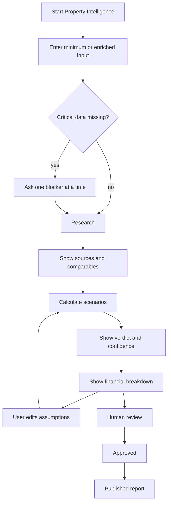

# Story UX-2 - Desenhar fluxo do MVP de IA Native

**Epic:** Evolução Modular do Lodgra + MVP de IA Native para Viabilidade de Propriedades  
**Status:** Ready for Review  
**Owner:** @ux-design-expert  
**Quality Gate:** @pm + @architect  
**Depends On:** PM-2, ARCH-2

---

## UX Intent

O MVP de IA Native precisa ser percebido como uma capability de apoio à decisão, não como mais um formulário operacional.

A experiência deve guiar o utilizador da entrada dos dados até a leitura do resultado de forma clara, rápida e com contexto suficiente para decidir se vale prosseguir.

## Story

**Como** utilizador que avalia uma propriedade,  
**Quero** um fluxo claro para inserir dados e ler a previsão,  
**Para que** eu entenda rapidamente o valor do MVP de IA.

## Context

O MVP é validado fora do core e precisa comunicar isso visualmente e semanticamente.

Se o fluxo parecer uma tela operacional comum, a intenção de produto fica diluída.

## UX-2 Baseline

Esta story parte de dois contratos já fechados:

- a PM-2 define o problema, a pergunta central, o público-alvo, os inputs, os outputs e os limites do MVP
- a ARCH-2 define o fluxo de entrada, processamento e saída, os estados rastreáveis e o desligamento seguro

O trabalho da UX-2 não é reinventar o produto. É traduzir esse contrato em uma experiência clara de decisão, com:
- entrada mínima ou enriquecida
- leitura imediata de viabilidade e risco
- confiança visível no fluxo principal
- separação explícita entre validação e operação diária
- compatibilidade com a implementação isolada da DEV-3

## Acceptance Criteria

### AC1: Entrada simplificada
- [x] O fluxo mostra quais dados são necessários
- [x] O fluxo não parece um formulário operacional genérico
- [x] O fluxo explica a lógica em linguagem de produto

### AC2: Resultado legível
- [x] O resultado mostra viabilidade com clareza
- [x] O resultado mostra previsão de retorno com contexto
- [x] O resultado mostra níveis de confiança ou risco

### AC3: Encaminhamento para produto
- [x] O fluxo mostra que o MVP é uma capability separada
- [x] O fluxo deixa claro quando algo já é válido para o Lodgra
- [x] O fluxo não confunde validação com operação diária

### AC4: Compatível com a arquitetura
- [x] O fluxo respeita o contrato definido pela ARCH-2
- [x] O fluxo pode ser implementado fora do operacional
- [x] O fluxo pode ser integrado depois sem redesenho

## Scope

### In scope
- wireflow do MVP
- estrutura de leitura de resultados
- guidelines de linguagem e hierarchy
- estados de entrada, processamento e resultado

### Out of scope
- implementação visual final
- modelo de IA em si
- integração ao shell
- rollout em produção

## Deliverables

- wireflow do MVP
- estrutura de leitura de resultados
- guidelines de linguagem e hierarchy
- base para DEV-3

## UX-2 Design Checklist

### 1. Entry framing
- [x] The first screen must say this is an analysis capability, not an operations form
- [x] The empty state must reduce fear of making mistakes
- [x] The user must understand the module in one sentence

### 2. Input behavior
- [x] Ask only for minimum viable data first
- [x] Allow pasted text or JSON-like input
- [x] Ask one blocker at a time when clarification is needed
- [x] Explain why each missing field matters

### 3. Result hierarchy
- [x] Show one-line verdict first
- [x] Show viability score and confidence before the detailed numbers
- [x] Show short stay, medium stay and long stay side by side
- [x] Show conservative, base and optimized scenarios in the same hierarchy
- [x] Show gross revenue, estimated costs, commission and owner net return

### 4. Evidence and action
- [x] Show sources, assumptions and gaps below the results
- [x] Make edit and recalculate primary actions
- [x] Make human approval the final action before publication
- [x] Keep the approved state visually distinct from draft / researching

### 5. Accessibility and responsiveness
- [x] Keep the flow readable on smaller screens
- [x] Do not rely on color alone
- [x] Keep confidence and risk visible in text and iconography
- [x] Keep the evidence section scannable
- [x] Keep action buttons visually distinct

---

## UX Flow Model

### Entry point
- the user enters from a dedicated Property Intelligence module
- the screen clearly states that this is an analysis capability, not an operations form
- the first step asks for the minimum viable data and allows pasted text or JSON-like input

### Entry framing note
- The UI should feel like a guided analysis workspace, not a CRUD form.
- The first sentence on the screen should explain what the module does and why it exists.
- The user should know immediately that this is a decision aid for viability and return.

### Progressive disclosure
- only blockers that cannot be researched are asked back
- the system explains why a field is needed
- the flow prefers one question at a time when clarification is required
- if enough data exists, the system moves directly to research and calculation states

### Progressive disclosure note
- If the system can infer or research a value, it should not ask for it.
- Questions must feel like blockers to decision-making, not form validation chores.
- Each question should tell the user what is missing and what it unlocks.

### Processing states

| State | User-facing meaning |
| --- | --- |
| draft | Analysis started, not yet processed. |
| needs_input | Something critical is missing and must be clarified. |
| researching | The system is gathering sources and comparables. |
| calculating | The financial engine is producing scenarios. |
| needs_review | Results are ready for human review. |
| approved | The manager approved the analysis. |
| published | The report is ready to share externally. |
| failed | The analysis stopped with a traceable issue. |

### Result reading flow
1. Show a one-line verdict first.
2. Show the viability score and confidence before detailed numbers.
3. Show short stay, medium stay and long stay side by side.
4. Show conservative, base and optimized scenarios in the same visual hierarchy.
5. Show gross revenue, estimated costs, commission and owner net return.
6. Show assumptions, sources and gaps below the results.
7. Offer edit and recalculate as a primary action.
8. Offer human approval as the final action before publication.

### Result reading note
- The first read should answer "is this viable?" before showing detailed financial tables.
- Confidence and risk must be visible without hunting.
- The owner-facing interpretation should stay obvious even when the underlying analysis is complex.

---

## Information Hierarchy

### 1. Verdict area
- decision summary
- viability score
- confidence / risk indicator
- status badge

### 2. Scenario comparison
- short stay
- medium stay
- long stay
- conservative / base / optimized

### 3. Financial breakdown
- gross revenue
- fixed costs
- variable costs
- management commission
- owner net return

### 4. Evidence and assumptions
- sources used
- assumptions applied
- missing data
- overrides made by the reviewer

### 5. Action area
- edit assumptions
- recalculate
- request more input
- approve and publish

## Content Rules

- Say `viável`, `precisa de mais dados` or `risco elevado` before raw detail.
- Distinguish `preço observado`, `premissa`, `estimativa` and `resultado`.
- Never make the user infer which stay model is being shown.
- Never hide confidence in a tooltip only.
- Never present publication as part of the default analysis loop.

---

## Language Guidelines

- Use plain language, not engineering jargon.
- Say `viável`, `precisa de mais dados` or `risco elevado` before exposing numeric detail.
- Always show that results are estimates, not guarantees.
- Always distinguish `preço observado`, `premissa`, `estimativa` and `resultado`.
- Avoid making the user infer whether the result is for short stay, medium stay or long stay.
- Avoid hiding confidence in a tooltip only; it must be visible in the main flow.

---

## Wireflow

---

## UI Writing Rules

- The first screen should explain the module in one sentence.
- The empty state should help the user start without fear of making mistakes.
- Error states should tell the user what to fix and what is still safe to keep.
- The result screen must make the next step obvious.
- The approved state must feel distinct from the draft or research state.

---

## Accessibility and Layout Notes

- Results should remain readable on smaller screens, but the main validation flow is desktop-first.
- The hierarchy must not rely on color alone.
- Confidence and risk need both iconography and text.
- The evidence section must be scannable without hiding important data.
- Buttons for edit, recalculate and approve must be visually distinct.

## UX-2 Handoff Package

### For DEV-3
- implement the flow outside the operational shell
- keep the entry point dedicated to Property Intelligence
- preserve the state machine and the result hierarchy

### For PM and ARCH follow-up
- validate whether the final naming of the module or its sections needs refinement
- confirm that the confidence / risk presentation remains aligned with the product language
- confirm the output hierarchy stays readable as data density grows

---

## Handoff Criteria to DEV-3

This story is ready to move to DEV-3 when:
- the entry flow is clearly not an operations form
- the result hierarchy is explicit
- the states are mapped to the architecture contract
- the user can understand when to edit, recalculate and approve
- the flow can be implemented without depending on the shell

## Handoff Notes

- esta story deve ser consumida após PM-2 e ARCH-2
- a próxima story da cadeia é DEV-3
